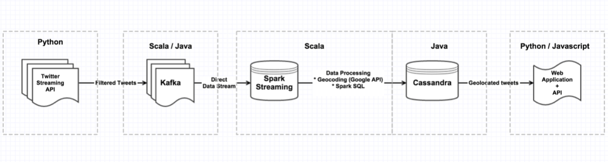
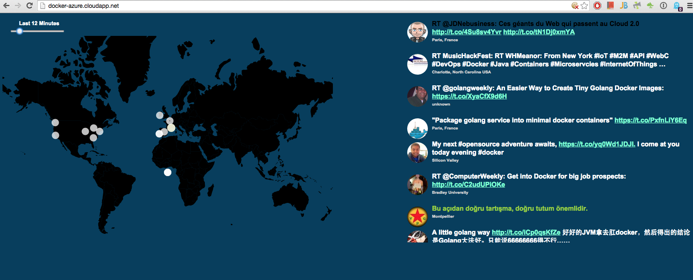

DATA-PROCESSING-PIPELINE
==============

## Description

Build a powerful *Real-Time Data Processing Pipeline & Visualization* solution using Docker Machine and Compose, Kafka, Cassandra and Spark in 5 steps.

See below the project's architecture: 



## What's happening under the hood? 
We connect to the twitter streaming API (https://dev.twitter.com/streaming/overview) and start to listen to events based on a list of keywords, these events are forwarded directly to Kafka (no parsing). In the middle, there is a spark job collecting those events, converting them to Spark SQL context (http://spark.apache.org/sql/) which filters the kafka message and extract only the fields of interest which in this case are: *user.location, text and user.profile_image_url*, once we have that, we convert the *location* into coordinates (lat,lng) using the google geoconding API (https://developers.google.com/maps/documentation/geocoding/intro) and persist the data into Cassandra. 

Finally, there is a web application running that is fetching data from Cassandra and rendering the tweets of interest on the world map.



### Some Interesting Project Stats
##### Number of Containers: 8
##### Number of Open Source Projects Used: 8
##### Number of Programming Languages Used: 4 (Python, Bash, Scala, Java)

## Pre-requisites

### Docker (https://docs.docker.com/installation/)
```
$ wget -qO- https://get.docker.com/ | sh
```

### Docker Machine (https://docs.docker.com/machine/install-machine/)
```
$ curl -L https://github.com/docker/machine/releases/download/v0.8.2/docker-machine_`uname -s`-amd64 > /usr/local/bin/docker-machine
$ chmod +x /usr/local/bin/docker-machine
```

### Docker Compose (https://docs.docker.com/compose/install/)
```
$ curl -L https://github.com/docker/compose/releases/download/1.8.1/docker-compose-`uname -s`-`uname -m` > /usr/local/bin/docker-compose
$ chmod +x /usr/local/bin/docker-compose
```

## Project Installation / Usage
### Step 1: Create a VM with Docker
If you already have a VM running or if you are on Linux, you can skip this step. Otherwise, the steps are the following:

#### On Digital Ocean
##### a) Create a Digital Ocean Token
You need to create a personal access token under “Apps & API” in the Digital Ocean Control Panel.

##### b) Grab your access token, then run docker-machine create with these details:
```
$ docker-machine create --driver digitalocean --digitalocean-access-token=<access token> Docker-VM
```
#### On VirtualBox
You just need to run: 
```
$ docker-machine create -d virtualbox --virtualbox-memory 2048 Docker-VM
```
#### On Microsoft Azure
#### a) Create certificate
```
$ openssl req -x509 -nodes -days 365 -newkey rsa:1024 -keyout mycert.pem -out mycert.pem
$ openssl pkcs12 -export -out mycert.pfx -in mycert.pem -name "My Certificate"
$ openssl x509 -inform pem -in mycert.pem -outform der -out mycert.cer
```
#### b) Upload the certificate to Microft Azure
Go to the Azure portal, go to the “Settings” page (you can find the link at the bottom of the left sidebar - you need to scroll), then “Management Certificates” and upload mycert.cer.
#### c) Grab your subscription ID from the portal (SUBSCRIPTIONS tab), then run docker-machine create with these details:
```
$ docker-machine create -d azure --azure-subscription-id="SUB_ID" --azure-subscription-cert="mycert.pem" azure-size="Medium" Docker-VM
```
#### d) Expose Port 80
When viewing your VM in the resource group you've created, scroll down to click Endpoints to view the endpoints on the VM. Add a new *endpoint* that exposes the port 80 and give it some name.

#### Access the VM
By default *docker-machine* will spin up an Ubuntu 14.04 instance on all cloud providers, as we are running multiple JAVA based applications that consumes a lot of memory, on the *docker-machine create* commands above I added an extra parameter to reserve at least 2GB of memory. The command below will ssh into the VM using your *ssh public key* 
```
$ docker-machine ssh Docker-VM
```

### Step 2: Getting Twitter API keys

In order to access Twitter Streaming API, we need to get 4 pieces of information from Twitter: API key, API secret, Access token and Access token secret. Follow the steps below to get all 4 elements:
<pre>
Create a twitter account if you do not already have one.
Go to https://apps.twitter.com/ and log in with your twitter credentials.
Click "Create New App"
Fill out the form, agree to the terms, and click "Create your Twitter application"
In the next page, click on "API keys" tab, and copy your "API key" and "API secret".
Scroll down and click "Create my access token", and copy your "Access token" and "Access token secret".
</pre>

### Step 3: Clone this repo and update the docker-compose.yml file (https://docs.docker.com/compose/yml/)
First you need to clone this repo:
```
$ git clone git@github.com:rogaha/data-processing-pipeline.git
```
Then, we need to update the kafka advertized host name, the twitter API credentials and the keywords you want to track. Below are the enviroment variables that need to be updated:
```
KAFKA_ADVERTISED_HOST_NAME: "" (public IP or the IP of your local VM)
ACCESS_TOKEN: ""
ACCESS_TOKEN_SECRET: ""
CONSUMER_KEY: ""
CONSUMER_SECRET: ""
KEYWORDS_LIST: ""
GOOGLE_GEOCODING_API_KEY: "." (use "." to ignore it)
```
In order to get the *public IP* of your Digital Ocean droplet you can run from the VM:
```
$ /sbin/ifconfig eth0 | grep 'inet addr:' | cut -d: -f2 | awk '{ print $1}'
```

The *KEYWORDS_LIST* shoud be a comma separated string, such as: "python, scala, golang"

### Step 4: Start All the Containers
With docker-compose you can just run:
```
$ docker-compose up -d
```
The output should be: 
```
Creating dataprocessingpipeline_zookeeper_1...
Creating dataprocessingpipeline_sparkmaster_1...
Creating dataprocessingpipeline_kafka_1...
Creating dataprocessingpipeline_twitterkafkaproducer_1...
Creating dataprocessingpipeline_cassandra_1...
Creating dataprocessingpipeline_sparkjob_1...
Creating dataprocessingpipeline_webserver_1...
Creating dataprocessingpipeline_sparkworker_1...
```

After that you should wait a few seconds, I've a 15 seconds delay before starting the spark-job, kafka producer and webcontainer containers, in order to make all the dependencies are up and running.
### Step 5: Access the IP/Hostname of your machine from your browser
I've cloned this repo, updated the environment variables and started the containers on Azure. 

## Open Source Projects Used

#### Docker (https://github.com/docker/docker)
An open platform for distributed applications for developers and sysadmins
#### Docker Machine (https://github.com/docker/machine)
Lets you create Docker hosts on your computer, on cloud providers, and inside your own data center
#### Docker Compose (https://github.com/docker/compose)
Tool for defining and running multi-container applications with Docker
#### Apache Spark / Spark SQL (https://github.com/apache/spark)
 A fast, in-memory data processing engine. Spark SQL lets you query structured data as a resilient distributed dataset (RDD)
#### Apache Kafka (https://github.com/apache/kafka)
A fast and scalable pub-sub messaging service
#### Apache Kookeeper (https://github.com/apache/zookeeper)
A distributed configuration service, synchronization service, and naming registry for large distributed systems
#### Apache Cassandra (https://github.com/apache/cassandra)
 Scalable, high-available and distributed columnar NoSQL database
#### D3 (https://github.com/mbostock/d3)
A JavaScript visualization library for HTML and SVG. 
